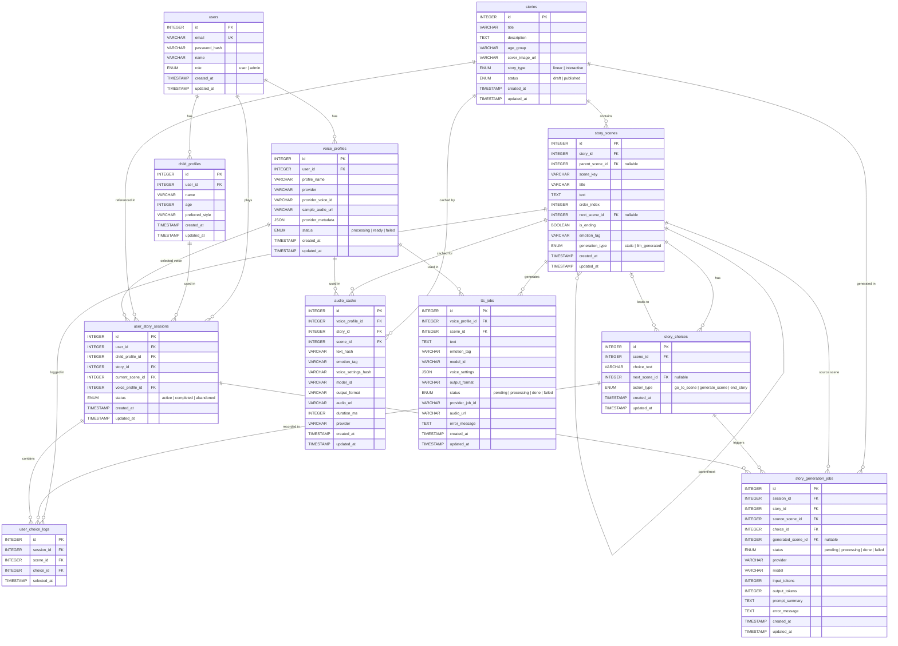

# DB ERD 설계서
> Interactive Story App — MVP Database Schema v2.0  
> 일반 동화 + 인터랙티브 동화 공용 구조 / INTEGER PK / 단일 Story Agent + ElevenLabs TTS Pipeline 기준

---

## 설계 기준

- **PK/FK 타입**: 모든 내부 PK/FK는 `INTEGER` Auto Increment/Identity를 사용한다.
- **동화 타입 분리 방식**: 일반 동화와 인터랙티브 동화는 테이블을 분리하지 않고 `stories.story_type`으로 구분한다.
  - `linear`: 일반 동화, 장면 순차 재생
  - `interactive`: 선택지 기반 인터랙티브 동화
- **AI 구조**: Multi-Agent가 아니라 Story Engine 내부의 단일 Story Agent만 사용한다.
- **TTS 구조**: ElevenLabs API 고정, `emotion_tag`를 `voice_settings`로 변환하는 TTS Pipeline 사용.
- **음성 캐싱**: `voice_profile_id + scene_id + text_hash + emotion_tag + voice_settings_hash + model_id + output_format` 기준으로 캐시한다.

---

## ERD 다이어그램



---

## 테이블별 상세 명세

### `users` — 사용자 계정

| 컬럼 | 타입 | 제약 | 설명 |
|------|------|------|------|
| id | INTEGER | PK, NOT NULL, IDENTITY | 사용자 ID |
| email | VARCHAR(255) | UNIQUE, NOT NULL | 로그인 이메일 |
| password_hash | VARCHAR(255) | NOT NULL | 비밀번호 해시 |
| name | VARCHAR(100) | NOT NULL | 표시 이름 |
| role | ENUM | NOT NULL, DEFAULT 'user' | user \| admin |
| created_at | TIMESTAMP | NOT NULL, DEFAULT NOW() | 생성일 |
| updated_at | TIMESTAMP | NOT NULL | 수정일 |

**인덱스**
- `idx_users_email` on `email`

---

### `child_profiles` — 아이 프로필

| 컬럼 | 타입 | 제약 | 설명 |
|------|------|------|------|
| id | INTEGER | PK, NOT NULL, IDENTITY | 아이 프로필 ID |
| user_id | INTEGER | FK → users.id, NOT NULL | 보호자 계정 |
| name | VARCHAR(100) | NOT NULL | 아이 이름 |
| age | INTEGER | NOT NULL | 나이 |
| preferred_style | VARCHAR(50) | NULL | adventure, fairy_tale, animal 등 |
| created_at | TIMESTAMP | NOT NULL | 생성일 |
| updated_at | TIMESTAMP | NOT NULL | 수정일 |

**인덱스**
- `idx_child_profiles_user_id` on `user_id`

---

### `stories` — 동화 메타데이터

| 컬럼 | 타입 | 제약 | 설명 |
|------|------|------|------|
| id | INTEGER | PK, NOT NULL, IDENTITY | 동화 ID |
| title | VARCHAR(200) | NOT NULL | 동화 제목 |
| description | TEXT | NULL | 줄거리/소개 |
| age_group | VARCHAR(10) | NOT NULL | 예: 3-5, 6-8 |
| cover_image_url | VARCHAR(500) | NULL | Cloud Storage 경로 |
| story_type | ENUM | NOT NULL, DEFAULT 'linear' | linear \| interactive |
| status | ENUM | NOT NULL, DEFAULT 'draft' | draft \| published |
| created_at | TIMESTAMP | NOT NULL | 생성일 |
| updated_at | TIMESTAMP | NOT NULL | 수정일 |

**인덱스**
- `idx_stories_status` on `status`
- `idx_stories_age_group` on `age_group`
- `idx_stories_story_type` on `story_type`

---

### `story_scenes` — 동화 장면

| 컬럼 | 타입 | 제약 | 설명 |
|------|------|------|------|
| id | INTEGER | PK, NOT NULL, IDENTITY | 장면 ID |
| story_id | INTEGER | FK → stories.id, NOT NULL | 소속 동화 |
| parent_scene_id | INTEGER | FK → story_scenes.id, NULL | Story Agent 생성 장면의 부모 장면 |
| scene_key | VARCHAR(100) | NOT NULL | 예: start, chapter1_a |
| title | VARCHAR(200) | NULL | 장면 제목 |
| text | TEXT | NOT NULL | 낭독 텍스트 |
| order_index | INTEGER | NOT NULL | 일반 동화 순차 재생 순서 |
| next_scene_id | INTEGER | FK → story_scenes.id, NULL | 일반 동화의 명시적 다음 장면 |
| is_ending | BOOLEAN | NOT NULL, DEFAULT FALSE | 엔딩 여부 |
| emotion_tag | VARCHAR(20) | NULL | calm, happy, nervous, sad, excited 등 |
| generation_type | ENUM | NOT NULL, DEFAULT 'static' | static \| llm_generated |
| created_at | TIMESTAMP | NOT NULL | 생성일 |
| updated_at | TIMESTAMP | NOT NULL | 수정일 |

**인덱스**
- `idx_story_scenes_story_id` on `story_id`
- `idx_story_scenes_story_id_order` on `(story_id, order_index)`
- `idx_story_scenes_scene_key` on `(story_id, scene_key)` UNIQUE
- `idx_story_scenes_parent_scene_id` on `parent_scene_id`

---

### `story_choices` — 인터랙티브 선택지

| 컬럼 | 타입 | 제약 | 설명 |
|------|------|------|------|
| id | INTEGER | PK, NOT NULL, IDENTITY | 선택지 ID |
| scene_id | INTEGER | FK → story_scenes.id, NOT NULL | 소속 장면 |
| choice_text | VARCHAR(300) | NOT NULL | 선택지 표시 텍스트 |
| next_scene_id | INTEGER | FK → story_scenes.id, NULL | 이동할 다음 장면 |
| action_type | ENUM | NOT NULL | go_to_scene \| generate_scene \| end_story |
| created_at | TIMESTAMP | NOT NULL | 생성일 |
| updated_at | TIMESTAMP | NOT NULL | 수정일 |

> `action_type = 'generate_scene'`이면 Story Engine이 단일 Story Agent를 호출한다.

**인덱스**
- `idx_story_choices_scene_id` on `scene_id`
- `idx_story_choices_next_scene_id` on `next_scene_id`

---

### `user_story_sessions` — 동화 재생 세션

| 컬럼 | 타입 | 제약 | 설명 |
|------|------|------|------|
| id | INTEGER | PK, NOT NULL, IDENTITY | 세션 ID |
| user_id | INTEGER | FK → users.id, NOT NULL | 사용자 ID |
| child_profile_id | INTEGER | FK → child_profiles.id, NOT NULL | 아이 프로필 ID |
| story_id | INTEGER | FK → stories.id, NOT NULL | 동화 ID |
| current_scene_id | INTEGER | FK → story_scenes.id, NULL | 현재 위치 장면 |
| voice_profile_id | INTEGER | FK → voice_profiles.id, NOT NULL | 사용 중인 음성 프로필 |
| status | ENUM | NOT NULL, DEFAULT 'active' | active \| completed \| abandoned |
| created_at | TIMESTAMP | NOT NULL | 생성일 |
| updated_at | TIMESTAMP | NOT NULL | 수정일 |

**인덱스**
- `idx_sessions_user_id` on `user_id`
- `idx_sessions_user_story` on `(user_id, story_id)`
- `idx_sessions_current_scene_id` on `current_scene_id`

---

### `user_choice_logs` — 선택 기록

| 컬럼 | 타입 | 제약 | 설명 |
|------|------|------|------|
| id | INTEGER | PK, NOT NULL, IDENTITY | 선택 로그 ID |
| session_id | INTEGER | FK → user_story_sessions.id, NOT NULL | 세션 ID |
| scene_id | INTEGER | FK → story_scenes.id, NOT NULL | 선택한 장면 |
| choice_id | INTEGER | FK → story_choices.id, NOT NULL | 선택한 선택지 |
| selected_at | TIMESTAMP | NOT NULL, DEFAULT NOW() | 선택 시각 |

> Story Agent 프롬프트 생성 시 최근 3~5개 레코드를 context로 활용한다.

**인덱스**
- `idx_choice_logs_session_id` on `session_id`
- `idx_choice_logs_session_selected` on `(session_id, selected_at DESC)`

---

### `voice_profiles` — ElevenLabs 음성 프로필

| 컬럼 | 타입 | 제약 | 설명 |
|------|------|------|------|
| id | INTEGER | PK, NOT NULL, IDENTITY | 음성 프로필 ID |
| user_id | INTEGER | FK → users.id, NOT NULL | 사용자 ID |
| profile_name | VARCHAR(100) | NOT NULL | 예: 아빠 목소리 |
| provider | VARCHAR(50) | NOT NULL, DEFAULT 'elevenlabs' | ElevenLabs 고정 |
| provider_voice_id | VARCHAR(200) | NULL | ElevenLabs voice_id |
| sample_audio_url | VARCHAR(500) | NULL | Cloud Storage 원본 샘플 경로 |
| provider_metadata | JSON | NULL | ElevenLabs clone metadata, settings 등 |
| status | ENUM | NOT NULL, DEFAULT 'processing' | processing \| ready \| failed |
| created_at | TIMESTAMP | NOT NULL | 생성일 |
| updated_at | TIMESTAMP | NOT NULL | 수정일 |

**인덱스**
- `idx_voice_profiles_user_id` on `user_id`
- `idx_voice_profiles_provider_voice_id` on `provider_voice_id`

---

### `audio_cache` — 생성된 오디오 캐시

| 컬럼 | 타입 | 제약 | 설명 |
|------|------|------|------|
| id | INTEGER | PK, NOT NULL, IDENTITY | 오디오 캐시 ID |
| voice_profile_id | INTEGER | FK → voice_profiles.id, NOT NULL | 음성 프로필 ID |
| story_id | INTEGER | FK → stories.id, NOT NULL | 동화 ID |
| scene_id | INTEGER | FK → story_scenes.id, NOT NULL | 장면 ID |
| text_hash | VARCHAR(64) | NOT NULL | SHA256(scene.text) |
| emotion_tag | VARCHAR(20) | NULL | 감정 태그 |
| voice_settings_hash | VARCHAR(64) | NOT NULL | ElevenLabs voice_settings 해시 |
| model_id | VARCHAR(100) | NOT NULL | 예: eleven_multilingual_v2 |
| output_format | VARCHAR(50) | NOT NULL | 예: mp3_44100_128 |
| audio_url | VARCHAR(500) | NOT NULL | Cloud Storage 경로 |
| duration_ms | INTEGER | NULL | 오디오 길이 |
| provider | VARCHAR(50) | NOT NULL, DEFAULT 'elevenlabs' | TTS 제공자 |
| created_at | TIMESTAMP | NOT NULL | 생성일 |
| updated_at | TIMESTAMP | NOT NULL | 수정일 |

**권장 Unique Key**
```sql
UNIQUE (voice_profile_id, scene_id, text_hash, emotion_tag, voice_settings_hash, model_id, output_format)
```

**인덱스**
- `idx_audio_cache_lookup` on `(voice_profile_id, scene_id, text_hash)`
- `idx_audio_cache_story_scene` on `(story_id, scene_id)`

---

### `tts_jobs` — ElevenLabs TTS 비동기 작업

| 컬럼 | 타입 | 제약 | 설명 |
|------|------|------|------|
| id | INTEGER | PK, NOT NULL, IDENTITY | TTS 작업 ID |
| voice_profile_id | INTEGER | FK → voice_profiles.id, NOT NULL | 음성 프로필 ID |
| scene_id | INTEGER | FK → story_scenes.id, NOT NULL | 장면 ID |
| text | TEXT | NOT NULL | TTS 입력 텍스트 |
| emotion_tag | VARCHAR(20) | NULL | 감정 태그 |
| model_id | VARCHAR(100) | NOT NULL | ElevenLabs model_id |
| voice_settings | JSON | NOT NULL | ElevenLabs voice_settings |
| output_format | VARCHAR(50) | NOT NULL | 출력 포맷 |
| status | ENUM | NOT NULL, DEFAULT 'pending' | pending \| processing \| done \| failed |
| provider_job_id | VARCHAR(200) | NULL | 외부 작업 추적 ID, 없을 수 있음 |
| audio_url | VARCHAR(500) | NULL | 완료 시 Cloud Storage 경로 |
| error_message | TEXT | NULL | 실패 메시지 |
| created_at | TIMESTAMP | NOT NULL | 생성일 |
| updated_at | TIMESTAMP | NOT NULL | 수정일 |

**인덱스**
- `idx_tts_jobs_status` on `status`
- `idx_tts_jobs_scene_voice` on `(scene_id, voice_profile_id)`

---

### `story_generation_jobs` — Story Agent 생성 작업 로그

| 컬럼 | 타입 | 제약 | 설명 |
|------|------|------|------|
| id | INTEGER | PK, NOT NULL, IDENTITY | Story Agent 생성 작업 ID |
| session_id | INTEGER | FK → user_story_sessions.id, NOT NULL | 세션 ID |
| story_id | INTEGER | FK → stories.id, NOT NULL | 동화 ID |
| source_scene_id | INTEGER | FK → story_scenes.id, NOT NULL | 생성 기준 장면 |
| choice_id | INTEGER | FK → story_choices.id, NOT NULL | 사용자가 선택한 선택지 |
| generated_scene_id | INTEGER | FK → story_scenes.id, NULL | 생성된 장면 |
| status | ENUM | NOT NULL, DEFAULT 'pending' | pending \| processing \| done \| failed |
| provider | VARCHAR(50) | NOT NULL | LLM Provider |
| model | VARCHAR(100) | NOT NULL | 사용 모델 |
| input_tokens | INTEGER | NULL | 입력 토큰 수 |
| output_tokens | INTEGER | NULL | 출력 토큰 수 |
| prompt_summary | TEXT | NULL | 프롬프트 요약 |
| error_message | TEXT | NULL | 실패 메시지 |
| created_at | TIMESTAMP | NOT NULL | 생성일 |
| updated_at | TIMESTAMP | NOT NULL | 수정일 |

**인덱스**
- `idx_story_generation_jobs_session` on `session_id`
- `idx_story_generation_jobs_status` on `status`
- `idx_story_generation_jobs_generated_scene` on `generated_scene_id`

---

## 일반 동화와 인터랙티브 동화 처리 방식

### 일반 동화 (`stories.story_type = 'linear'`)

- `story_scenes.order_index` 순서대로 재생한다.
- 선택지가 없어도 된다.
- 다음 장면은 `story_scenes.next_scene_id`가 있으면 우선 사용하고, 없으면 `order_index + 1` 기준으로 찾는다.
- API는 `POST /sessions/{session_id}/next`를 사용한다.

### 인터랙티브 동화 (`stories.story_type = 'interactive'`)

- 각 장면은 `story_choices`를 가질 수 있다.
- `action_type = 'go_to_scene'`이면 `next_scene_id`로 이동한다.
- `action_type = 'generate_scene'`이면 Story Agent가 새 장면과 선택지, 감정 태그를 생성한다.
- API는 `POST /sessions/{session_id}/choices`를 사용한다.

---

## 캐시 조회 쿼리 예시

```sql
-- 오디오 캐시 확인
SELECT audio_url
FROM audio_cache
WHERE voice_profile_id = :voice_profile_id
  AND scene_id = :scene_id
  AND text_hash = :text_hash
  AND emotion_tag = :emotion_tag
  AND voice_settings_hash = :voice_settings_hash
  AND model_id = :model_id
  AND output_format = :output_format
LIMIT 1;

-- 세션의 최근 선택 기록 조회
SELECT sc.choice_text, ss.scene_key
FROM user_choice_logs ucl
JOIN story_choices sc ON ucl.choice_id = sc.id
JOIN story_scenes ss ON ucl.scene_id = ss.id
WHERE ucl.session_id = :session_id
ORDER BY ucl.selected_at DESC
LIMIT 5;

-- 일반 동화 다음 장면 조회
SELECT *
FROM story_scenes
WHERE story_id = :story_id
  AND order_index = :current_order_index + 1
LIMIT 1;

-- 인터랙티브 동화 선택지 기반 다음 장면 조회
SELECT ss.*
FROM story_choices sc
JOIN story_scenes ss ON sc.next_scene_id = ss.id
WHERE sc.id = :choice_id
  AND sc.action_type = 'go_to_scene';
```

---

## 마이그레이션 실행 순서

```
1. users
2. child_profiles          (→ users)
3. voice_profiles          (→ users)
4. stories
5. story_scenes            (→ stories, self reference)
6. story_choices           (→ story_scenes)
7. user_story_sessions     (→ users, child_profiles, stories, story_scenes, voice_profiles)
8. user_choice_logs        (→ user_story_sessions, story_scenes, story_choices)
9. audio_cache             (→ voice_profiles, stories, story_scenes)
10. tts_jobs               (→ voice_profiles, story_scenes)
11. story_generation_jobs  (→ user_story_sessions, stories, story_scenes, story_choices)
```

---

*DB ERD v2.0 | Interactive Story App MVP | INTEGER PK 기준*
